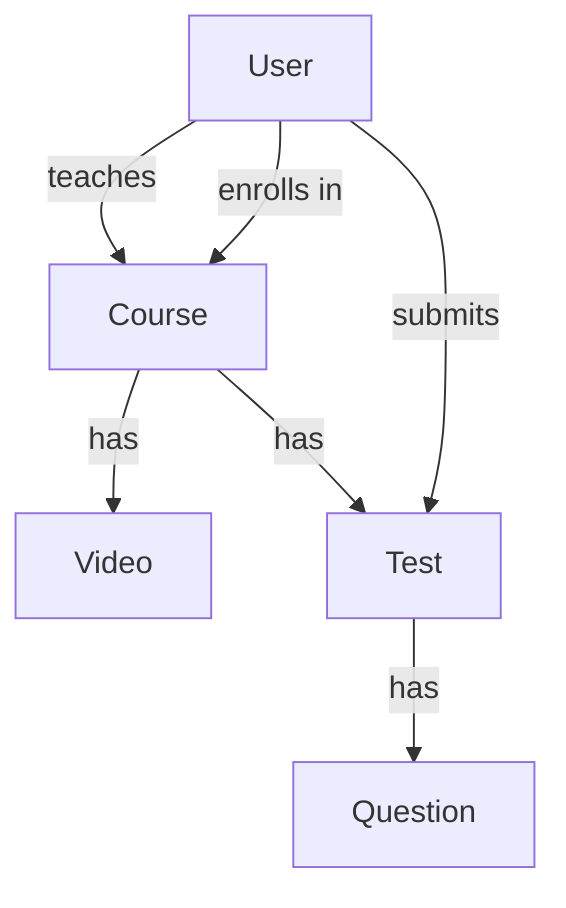

# EduTrack

EduTrack is a small online learning platform — the team project for the
Technology Sector Learning Track. Six people, one project, real GitHub
workflow. This README explains two things: **what we're building**, and
**exactly how to use Git/GitHub for it**.

Nothing here is graded on being fancy. It's graded on it working, and on
using the workflow correctly.

---

## What are we building?

Six things, each one a normal list of items — the same "list of products"
idea from your earlier exercises, just six different lists instead of one:

| Thing | What it is |
|---|---|
| **User** | A person — a teacher or a student. Has a username and password. |
| **Course** | A course, made by a teacher. |
| **Video** | A video that belongs to one course. |
| **Test** | A test that belongs to one course, made of Questions. |
| **Enrollment** | Records that a student joined a course. |
| **Submission** | A student's answers to a test, plus their score. |

They connect to each other — a Video can't exist without its Course, a
Submission can't exist without a Student and a Test. That's on purpose:
it forces the team to actually agree on things and integrate, not just
work in six separate bubbles.



**Storage:** everything lives in a plain Python list — `users = []`,
`courses = []`, and so on. No database. That's not a shortcut we're
ashamed of — it's exactly the right tool for what you know today.
Swapping it for a real database later will be easy precisely because
everything else is already clean and separated.

---

## Who's building what

| Role | Job |
|---|---|
| **Peer Lead** | Builds `main.py`, the one file that connects everyone's work together. Doesn't own a resource — floats around to help and review everyone else's PRs. |
| **Person A** | Users & login |
| **Person B** | Courses |
| **Person C** | Videos |
| **Person D** | Tests & Questions |
| **Person E** | Enrollments & Submissions |

**Important:** only the Peer Lead edits `main.py`. If you need something
changed there, ask them — don't edit it yourself, that file is shared by
everyone and editing it yourself is the #1 way to cause a mess.

## The one new tool: `APIRouter`

You already know `@app.get(...)`. The only new thing is that each person
writes their routes in their **own file**, using `router` instead of
`app`:

```python
# courses.py — this is Person B's file
from fastapi import APIRouter
router = APIRouter()

@router.get("/courses")
def get_courses():
    ...
```

Then the Peer Lead's `main.py` plugs everyone's file in:

```python
# main.py — only the Peer Lead touches this file
from fastapi import FastAPI
import users, courses, videos, tests, enrollments

app = FastAPI()
app.include_router(users.router)
app.include_router(courses.router)
app.include_router(videos.router)
app.include_router(tests.router)
app.include_router(enrollments.router)
```

That's it. Same skills, just split across files so five people aren't
editing the same file at once.

---

## Git Cheatsheet — follow these steps for every task

**The one hard rule: you can never push to `main` directly. GitHub will
reject it if you try — that's expected, not an error you caused.** The
only way your code reaches `main` is a Pull Request that someone else
approves.

### 1. Get the newest code
Do this *every time* you start something new — not just the first time.
```bash
git checkout main
git pull origin main
```

### 2. Make your own branch
Name it `team-N/short-description` (use your real team number).
```bash
git checkout -b team-1/courses-crud
```

### 3. Write your code
Normal work. Only touch your own file — never `main.py`.

### 4. Save your work
```bash
git add courses.py
git commit -m "Add full CRUD for courses"
```
`git add` followed by a filename saves *that* file's changes. Don't use
`git add .` — it can accidentally include files you didn't mean to add.

### 5. Send your branch to GitHub
```bash
git push -u origin team-1/courses-crud
```
This pushes **your branch**, not `main`. Totally different from pushing
to `main` — this always works.

### 6. Open a Pull Request
GitHub shows a "Compare & pull request" button right after your push.
Click it. Base branch: `main`. In the description, write which issue
this finishes:
```
Closes #4
```
(swap in your real issue number)

### 7. Get it reviewed
The Peer Lead or a mentor reviews your Pull Request. If they ask for
changes, just commit and push more — **to the same branch**, don't open
a new Pull Request. Once it's approved, it gets merged.

### 8. Reset for the next task
```bash
git checkout main
git pull origin main
```
Back to step 1.

### If Git shows you a conflict
Stop and ask your Peer Lead or mentor — don't guess. It's not a sign you
broke something; it just means two people changed nearby code, which is
normal when several people share a project.

---

## Issues — how you know what to build

Each of you already has one GitHub Issue, matching your role above (Users
& login, Courses, etc.). You don't need to write new Issues for this
project — just:

1. Open your Issue on GitHub.
2. Click **"assign yourself"** on the right side, so the team can see
   you're working on it.
3. Write `Closes #N` (using your Issue's number) in your Pull Request,
   like step 6 above. When your PR merges, the Issue closes by itself.

---

## Stuck?

Ask your Peer Lead first. If they're stuck too, ask a mentor. Getting
stuck is normal — this is exactly where you're supposed to learn the
real workflow, mistakes included.
