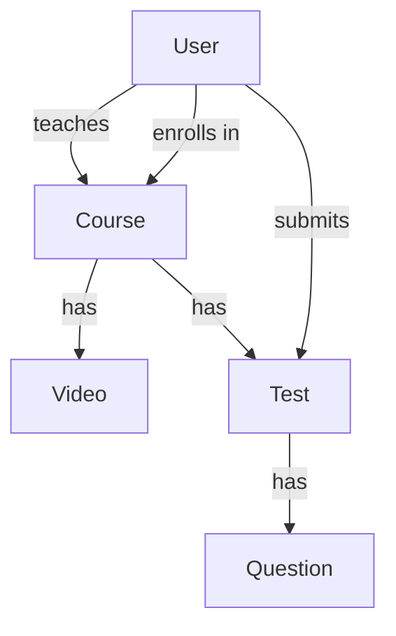

# EduTrack

EduTrack is a small online learning platform — the team project for the
Technology Sector Learning Track. Six people, one project, real GitHub
workflow. This README explains three things: **what we're building**,
**how much login/security to actually build**, and **exactly how to use
Git/GitHub for it**.

Nothing here is graded on being fancy. It's graded on it working, and on
using the workflow correctly.

**No AI usage is allowed anywhere in this project** — same rule as the
rest of the training. Write it yourself.

---

## What are we building?

Six things, each one a normal list of items — the same "list of products"
idea from your earlier exercises, just six different lists instead of one:

| Thing | What it is |
|---|---|
| **User** | A person — a teacher or a student. Has a username and password. |
| **Course** | A course, made by a teacher. |
| **Video** | A video that belongs to one course. |
| **Test** | A test that belongs to one course, made of Questions. |
| **Enrollment** | Records that a student joined a course. |
| **Submission** | A student's answers to a test, plus their score. |

They connect to each other — a Video can't exist without its Course, a
Submission can't exist without a Student and a Test. That's on purpose:
it forces the team to actually agree on things and integrate, not just
work in six separate bubbles.



**Storage:** everything lives in a plain Python list — `users = []`,
`courses = []`, and so on. No database. That's not a shortcut we're
ashamed of — it's exactly the right tool for what you know today.

**Marking a user as a teacher:** minimum is a boolean field, `teacher`,
defaulting to `False`. An Enum (`role: "teacher" | "student"`) is also
fine if you'd rather. Either is acceptable — if you have a better idea,
you're free to use it, as long as it's still clear from the model who's
a teacher.

---

## Six tracks, one each

| Track | Job |
|---|---|
| **Users & Login** | User CRUD, the `teacher` flag, and `/login`. |
| **Courses** | Course CRUD. Only teachers can create a course — see the Login section below for how to check that. |
| **Videos** | Video CRUD, listing a course's videos. |
| **Tests & Questions** | Test/Question CRUD, listing a course's tests. |
| **Enrollments** | Full CRUD — a student joining/leaving a course. |
| **Submissions** | Full CRUD, plus automatic grading — see your Issue for the scoring logic. |

Who takes which track gets decided separately (team vote) — this list is
just what each track actually involves.

**`main.py`** (the file that connects everyone's routers together) isn't
anyone's task. It's small enough that it doesn't need to be — it's wired
up centrally as each of your PRs gets reviewed and merged. You never need
to touch it yourself.

## The one new tool: `APIRouter`

You already know `@app.get(...)`. The only new thing is that each track
lives in its **own file**, using `router` instead of `app`:

```python
# courses.py
from fastapi import APIRouter
router = APIRouter()

@router.get("/courses")
def get_courses():
    ...
```

That's it. Same skills, just split across files so six people aren't
editing the same file at once.

---

## Login — the one rule that applies to every single endpoint

**Minimum requirement: write one login function, and call it at the top
of every CRUD operation you build — all six tracks, no exceptions.**
Something like:

```python
def login(username: str, password: str) -> User | None:
    for user in users:
        if user.username == username and user.password == password:
            return user
    return None
```

Every endpoint — `GET`, `POST`, `PUT`, `DELETE`, doesn't matter which —
takes a username and password (query params on `GET`s, body fields on
everything else), calls `login(...)` first, and returns a 401 if it
comes back `None`. No valid login, no operation — full stop, on every
single route in the app, not just the "important" ones.

**Teacher-only actions** build on the same function — once you have the
matched `User` back, just check its `teacher` flag (or `role`) before
continuing:

```python
user = login(username, password)
if user is None:
    raise HTTPException(status_code=401, detail="invalid login")
if not user.teacher:
    raise HTTPException(status_code=403, detail="teachers only")
```

This is exactly how **Courses** enforces "only a teacher can create a
course" — no new concept needed, just this same function plus one `if`.

**You're not locked into this exact shape.** A plain function called
everywhere is the minimum bar — if you want to try something more
elegant (a shared helper, a decorator, whatever), you're free to, as
long as the end result is the same: every operation actually requires a
real login.

**What this is not:** no password hashing, no tokens, no JWT, no real
security. That's intentional — it matches everything else in this
project, and it's not a pattern to reuse anywhere real. Actual production
auth is a topic for later, during onboarding.

**Extra points (Videos track):** if you want to go further, restrict who
can see a video's `url` — e.g. only users enrolled in that video's course
— using this same `login` function plus a lookup against Enrollments.
Not required, just a bonus if you finish early.

---

## Git Cheatsheet — follow these steps for every task

**The one hard rule: you can never push to `main` directly. GitHub will
reject it if you try — that's expected, not an error you caused.** The
only way your code reaches `main` is a Pull Request that someone else
approves.

### 1. Get the newest code
Do this *every time* you start something new — not just the first time.
```bash
git checkout main
git pull origin main
```

### 2. Make your own branch
Name it `team-N/short-description` (use your real team number).
```bash
git checkout -b team-1/courses-crud
```

### 3. Write your code
Normal work, in your own file. `main.py` isn't something you need to
touch.

### 4. Save your work
```bash
git add courses.py
git commit -m "Add full CRUD for courses"
```
`git add` followed by a filename saves *that* file's changes. Don't use
`git add .` — it can accidentally include files you didn't mean to add.

### 5. Send your branch to GitHub
```bash
git push -u origin team-1/courses-crud
```
This pushes **your branch**, not `main`. Totally different from pushing
to `main` — this always works.

### 6. Open a Pull Request
GitHub shows a "Compare & pull request" button right after your push.
Click it. Base branch: `main`. In the description, write which issue
this finishes:
```
Closes #4
```
(swap in your real issue number)

### 7. Get it reviewed
Mahmoud reviews every Pull Request personally. If changes are requested,
just commit and push more — **to the same branch**, don't open a new
Pull Request. Once it's approved, it gets merged (and wired into
`main.py` at the same time).

### 8. Reset for the next task
```bash
git checkout main
git pull origin main
```
Back to step 1.

### If Git shows you a conflict
Stop and ask — don't guess. It's not a sign you broke something; it just
means two people changed nearby code, which is normal when several
people share a project.

---

## Issues — how you know what to build

Each of you already has one GitHub Issue, matching your track above. You
don't need to write new Issues for this project — just:

1. Open your Issue on GitHub.
2. Click **"assign yourself"** on the right side, so the team can see
   you're working on it.
3. Write `Closes #N` (using your Issue's number) in your Pull Request,
   like step 6 above. When your PR merges, the Issue closes by itself.

Every Issue also has a **Bonus** section — an optional stretch goal for
if you finish your core CRUD early. None of them are required, and none
should be started before your track's actual required work is done.

---

## Stuck?

Ask the team first. If nobody's got it, ask Mahmoud. Getting stuck is
normal — this is exactly where you're supposed to learn the real
workflow, mistakes included.
